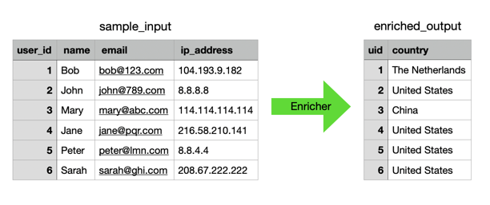
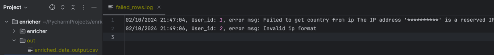

# HA_assessment
_Data Enrichment and Export_  
Enrich **country** information based on **IP address**. For data compliance purpose, source data will be removed once enrichment is finished.


## Installation

```console
# clone the repo
git clone https://github.com/willtjbai/enricher.git

# change the working directory to enricher
cd enricher

# install the requirements
python3 -m pip install -r requirements.txt

# Setup MaxMind account and key in .env file
cp .env_template .env
vi .env
```
## Usage
```console
 $ python3 -m enricher --help
usage: python3 -m enricher [-h] [-f FILE] [-o OUTPUT] [-ll LOGLEVEL]

Data enricher

optional arguments:
  -h, --help            show this help message and exit
  -f FILE, --file FILE  Input file
  -o OUTPUT, --output OUTPUT
                        Output file
  -ll LOGLEVEL, --loglevel LOGLEVEL
                        Log level

```

Run with sample data
```commandline
python3 -m enricher
```

Run with specified input file and output file
```commandline
python3 -m enricher -f ../../Desktop/sample_input.csv -o ./enriched_output.csv
```

Try it on colab
https://colab.research.google.com/drive/14wi7tupBquGSe6feTxnvjTiCmDvIjtk6?usp=sharing

## Error handling
Failed rows will be logged at ./out/failed_rows.log  




## Project overview

### Structure overview
```
- enricher/
    - enricher/
        - enricher_core.py  # Core enrichment process
        - source_reader.py  # Source reader, new source should extend DataSource
        - model.py          # Model for tasks and result
        - output_writer.py  # Output writer, new writer should extend BaseWriter
        - geo_fetcher.py    # Use MaxMind to fetch country based on IP
        - utils.py          # Common useful functions
    - tests/                # Unit tests
    - out/
        failed_rows.log     # Rows that failed to be enriched and error msg
    .env                    # Account and Key holder for MaxMind API
```
### Main process steps
1. Read source CSV, get user id and ip into Task list
2. For each task, call execute() to get Country info, IDs of failed records will be logged in ./out/failed_rows.log
3. Write User id + Country to CSV
4. Delete source file

## Tests
Run unit tests
```commandline
python3 -m unittest --verbose
```

## TO-DO
1. Use async/await to improve performance of task execution
2. Increase unit test coverage
3. Use mock in unit test 
4. Allow configuration for default paths
5. Cache IP->Country to avoid deplicate api call
6. Static code analysis, pylint etc.
7. CICD
